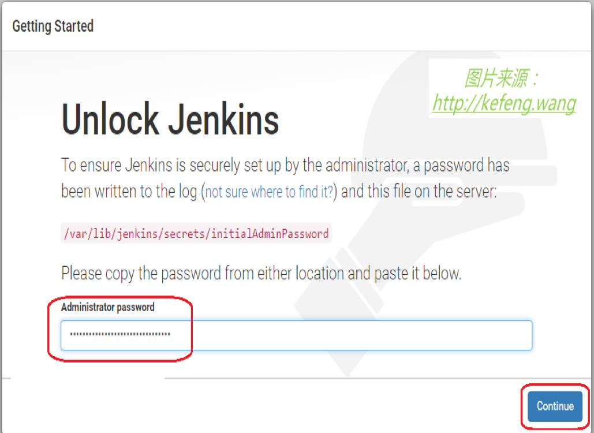
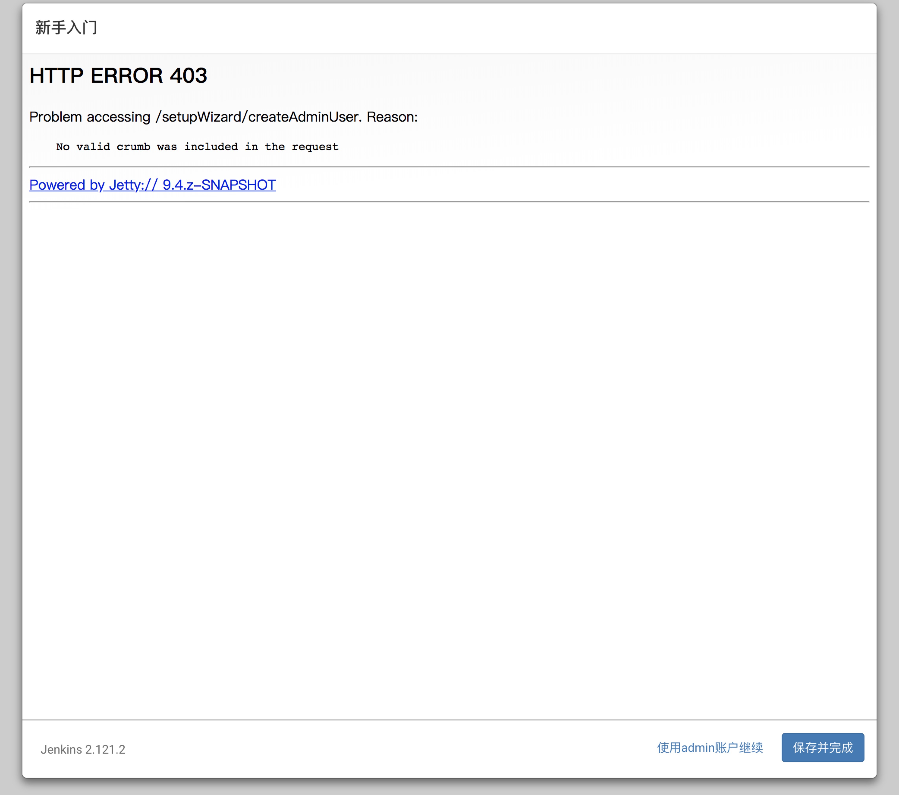
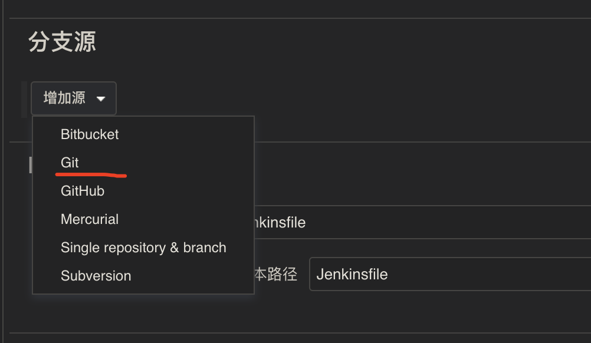
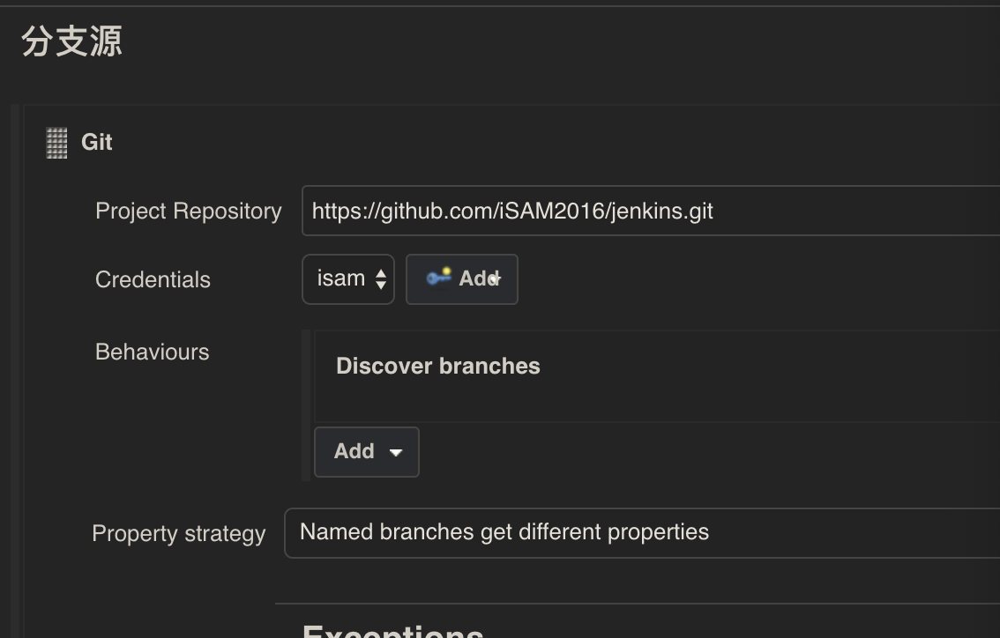
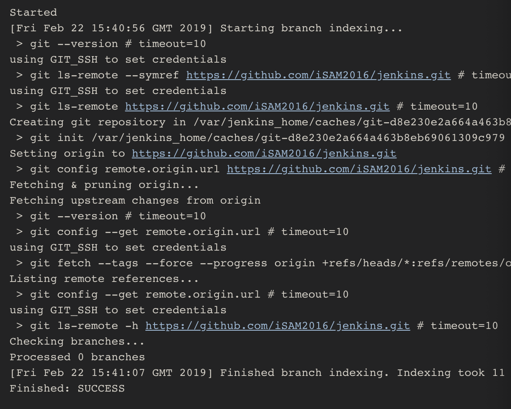

# About

> cenntos7 系统
> 官网: https://jenkins.io/
> 请将代码使用 国内 git 工具

使用 jenkins(pipeline) 打造 CI/CD,jenkins 安装文档，帮助你填坑. docker 环境下安装,并运行 pipeline，其他辅助功能请参靠普通安装文档

特性

1. cenntos7
2. docker 安装
3. docker 环境运行
4. 配置 docker 环境
5. jenkins 用户切换，
6. pipeline 运行
7. 免密传输文件
8. 钉钉
9. Publish Over SSH
10. maven
11. git(github,码云)webHooks 触发
12. 多节点

jenkins 安装分为两种

1.  docker 环境下安装,并运行 pipeline（偏前端）推荐
2.  [普通安装包安装 （偏后端）（maven,节点）(离线安装， 在线安装基于， Tomcat 安装， 免安装方式) 请移步](./jenkins.md)

# 目录

- [About](#about)
- [目录](#%E7%9B%AE%E5%BD%95)
  - [0 docker 安装配置 （前置条件）](#0-docker-%E5%AE%89%E8%A3%85%E9%85%8D%E7%BD%AE-%E5%89%8D%E7%BD%AE%E6%9D%A1%E4%BB%B6)
    - [0.1 请参靠文章安装 docker](#01-%E8%AF%B7%E5%8F%82%E9%9D%A0%E6%96%87%E7%AB%A0%E5%AE%89%E8%A3%85-docker)
    - [0.2 TCP 端口打开](#02-tcp-%E7%AB%AF%E5%8F%A3%E6%89%93%E5%BC%80)
  - [1 安装 Jenkins](#1-%E5%AE%89%E8%A3%85-jenkins)
  - [1.1 docker 镜像 安装 jenkins](#11-docker-%E9%95%9C%E5%83%8F-%E5%AE%89%E8%A3%85-jenkins)
    - [1.1.1 下载 Jenkins 官方 docker 镜像](#111-%E4%B8%8B%E8%BD%BD-jenkins-%E5%AE%98%E6%96%B9-docker-%E9%95%9C%E5%83%8F)
    - [1.1.2 创建容器](#112-%E5%88%9B%E5%BB%BA%E5%AE%B9%E5%99%A8)
    - [1.1.3 销毁容器](#113-%E9%94%80%E6%AF%81%E5%AE%B9%E5%99%A8)
- [2 基本配置](#2-%E5%9F%BA%E6%9C%AC%E9%85%8D%E7%BD%AE)
  - [2.1 登录](#21-%E7%99%BB%E5%BD%95)
  - [2.2 安全设置](#22-%E5%AE%89%E5%85%A8%E8%AE%BE%E7%BD%AE)
  - [2.3 插件安装方法](#23-%E6%8F%92%E4%BB%B6%E5%AE%89%E8%A3%85%E6%96%B9%E6%B3%95)
    - [2.3.1 离线安装](#231-%E7%A6%BB%E7%BA%BF%E5%AE%89%E8%A3%85)
    - [2.3.2 在线安装](#232-%E5%9C%A8%E7%BA%BF%E5%AE%89%E8%A3%85)
- [3 项目接入-私有 Git 仓库帐号配置（通用版）](#3-%E9%A1%B9%E7%9B%AE%E6%8E%A5%E5%85%A5-%E7%A7%81%E6%9C%89-git-%E4%BB%93%E5%BA%93%E5%B8%90%E5%8F%B7%E9%85%8D%E7%BD%AE%E9%80%9A%E7%94%A8%E7%89%88)
  - [3.1 配置 SSH Key 登录配置](#31-%E9%85%8D%E7%BD%AE-ssh-key-%E7%99%BB%E5%BD%95%E9%85%8D%E7%BD%AE)
  - [3.2 在 Jenkins 配置 git ssh](#32-%E5%9C%A8-jenkins-%E9%85%8D%E7%BD%AE-git-ssh)
  - [3.3 新建构建项目](#33-%E6%96%B0%E5%BB%BA%E6%9E%84%E5%BB%BA%E9%A1%B9%E7%9B%AE)
    - [3.3.1 开始创建](#331-%E5%BC%80%E5%A7%8B%E5%88%9B%E5%BB%BA)
    - [3.3.2 配置 git](#332-%E9%85%8D%E7%BD%AE-git)
  - [3.4 手工触发构建](#34-%E6%89%8B%E5%B7%A5%E8%A7%A6%E5%8F%91%E6%9E%84%E5%BB%BA)
- [4 pipeline](#4-pipeline)
- [5 jenkins 用户权限](#5-jenkins-%E7%94%A8%E6%88%B7%E6%9D%83%E9%99%90)
  - [5.1 切换 jenkins 用户](#51-%E5%88%87%E6%8D%A2-jenkins-%E7%94%A8%E6%88%B7)
  - [5.2 ssh 免密码传输](#52-ssh-%E5%85%8D%E5%AF%86%E7%A0%81%E4%BC%A0%E8%BE%93)
- [6 SSH Agent 传输文件](#6-ssh-agent-%E4%BC%A0%E8%BE%93%E6%96%87%E4%BB%B6)

## 0 docker 安装配置 （前置条件）

### 0.1 请参靠文章安装 docker

[Centos7 上安装 docker](https://www.cnblogs.com/yufeng218/p/8370670.html)

### 0.2 TCP 端口打开

1. 开启 TCP 管理端口

-   1.1 创建目录/etc/systemd/system/docker.service.d

```
mkdir /etc/systemd/system/docker.service.d
```

-   1.2. 在这个目录下创建 tcp.conf 文件,增加以下内容

```
Ubuntu和CentOS7 通用版
cat > /etc/systemd/system/docker.service.d/tcp.conf <<EOF
[Service]
ExecStart=
ExecStart=/usr/bin/dockerd -H unix:///var/run/docker.sock -H tcp://0.0.0.0:2375
EOF
```

上面两个版本的区别在于用何种方式指定 Docker 守护进程本地套接字监听

```
-H fd://                                    仅Ubuntu可用
-H unix:///var/run/docker.sock              CentOS和Ubuntu通用
```

-   1.3. Daemon 重新 reload ，并重启 docker

```
systemctl daemon-reload
systemctl restart docker
```

-   1.4. 查看端口是否打开

```
ps aux |grep dockerd
或者
netstat -an | grep 2375
```

## 1 安装 Jenkins

## 1.1 docker 镜像 安装 jenkins

### 1.1.1 下载 Jenkins 官方 docker 镜像

> 镜像中包含 java 环境,无需在宿主机上二次安装

-   下载镜像

```

# docker pull jenkinsci/blueocean

```

### 1.1.2 创建容器

-   创建 jenkins 容器

```

docker run -d -u root -p 8080:8080 -v jenkins_home:/var/jenkins_home -v /var/run/docker.sock:/var/run/docker.sock -v "$HOME":/home jenkinsci/blueocean

```

参数解释：

-   `-v jenkins_home:/var/jenkins_home`
    -   创建`jenkins_home` 数据卷，映射到容器内部的目录是`/var/jenkins_home`
    -   在宿主机上执行`docker inspect jenkins_home` 查看 数据卷 在宿主机的目录

*   `-p 8080:8080`
    -   将容器内 8080 端口映射到主机的 8080 端口,主机端口可更换为其他

### 1.1.3 销毁容器

```

docker kill CONTAINER_ID

```

# 2 基本配置

## 2.1 登录

浏览器进入 http://IP:8080/

首次进入需要输入初始密码来解锁，

-   docker 下安装，密码存储在数据卷中，

```

# 查看 Mountpoint

# docker inspect jenkins_home

# 进入 Mountpoint 目录

# cd /var/lib/docker/volumes/jenkins_home/_data

# 查看密码

# sudo cat secrets/initialAdminPassword

```

进入 Jenkins 定制界面, 点击 Install suggested plugins



**注意**

如果遇到，如图问题，请多次重试点击 `使用admin账户继续`, 并进入 `系统管理/全局安全配置` 中，把`CSRF Protection` 选项关掉,如果关不掉，请勾选`允许用户注册`，然后点击`应用按钮`,`保存按钮`交叉点击，`应用按钮` 多点击。直到成功



## 2.2 安全设置

默认情况下，任何用户都可以使用 Jenkins 进行发布。
可以进入相关设置：`系统管理/Configure Global Security`,
选择 Jenkins 专有用户数据库，不要选中 允许用户注册；
选择 登录用户可以做任何事，选中 Allow anonymous read access

## 2.3 插件安装方法

如果安装插件失败率很高，可设置翻墙，请参考文章：[翻墙代理 Shadowsocks 使用详解](https://go.no123.info/123/tutorial/mac?nsukey=dmyAWkGzLrctYny1gyTgu3q1IP0sgxqvJBa1SDDVBW43qn1HA43n198Sd5nabHcS%2FLvzyfi8Neb%2FuUmNwboX51yuJ18NlWhjecQZi44DsXWoIPcbCHPgVnEMB5dQfcuC6v9eiq5fhhCxCMzFDPN7K3vlsDk3vCCUj6QmP5aXOXJBWYARS99jE7tm8VSUXUr%2FU9DGAEGzBLSImaOtWDCdbw%3D%3D)

### 2.3.1 离线安装

手工下载(\*.hpi): http://updates.jenkins-ci.org/download/plugins/
进入：`系统管理 / 管理插件 / 高级`，然后上传插件进行安装。
无需重启 Jenkins 插件即生效。

### 2.3.2 在线安装

进入：`系统管理 / 管理插件 / 可选插件`
查找并勾选所需插件，点击“直接安装”；
无需重启 Jenkins 插件即生效。如遇失败可重试或离线安装。

# 3 项目接入-私有 Git 仓库帐号配置（通用版）

> 注意此时我们是在 root 下

## 3.1 配置 SSH Key 登录配置

1. 生成 SSH 密钥打开终端命令工具，输入命令：

```

ssh-keygen -t rsa

回车
```

公钥内容在 ~/.ssh/id_rsa.pub

私有内容在 ~/.ssh/id_rsa

2.  把公钥的内容加入 码云（或其他） 的 SSH 密钥中

将公钥贴在 用户设置的 SSH 公钥贴入这个

**注意一个用户可以用多个 SSH 公钥**

## 3.2 在 Jenkins 配置 git ssh

在 Jenkins ->Credentials->System--> Add credentials

新增登录方式


选择 SSH Username with private key. 使用私钥


## 3.3 新建构建项目

### 3.3.1 开始创建

主页：点击“新建”；

项目类型：输入项目名称 testTask，类型选择“多分支流水线”

### 3.3.2 配置 git

如图





保存即可

保存之后代码自动扫描,并会出现，分支信息



## 3.4 手工触发构建

进入 My Views, 右侧看到各个项目；
点击进入关注的项目，点击左侧的“立即构建”；


开始构建或构建完毕后，左下方列出每次构建的链接，点击进入某次构建；
点击左侧的“Console Output”，可查看构建日志，如有报错可以看到；


纠正错误后，返回到工程，再次点击“立即构建”，直至构建成功；
如有网络相关报错，重试几次也会成功。
package -Dmaven.test.skip=true

# 4 pipeline

> [参看](https://m.baidu.com/from=1086k/bd_page_type=1/ssid=0/uid=0/pu=usm%402%2Csz%40320_1002%2Cta%40iphone_2_7.1_2_12137.1/baiduid=F00D0A84A21B0D88C2C16F349EF44165/w=0_10_/t=iphone/l=3/tc?ref=www_iphone&lid=8117434510933041957&order=2&fm=alop&isAtom=1&is_baidu=0&tj=www_normal_2_0_10_title&vit=osres&m=8&srd=1&cltj=cloud_title&asres=1&title=jenkinsPipeline%E8%84%9A%E6%9C%ACjenkinsfile%E5%AE%9E%E6%93%8D%E6%8C%87%E5%8D%97%7CKL%E5%8D%9A%E5%AE%A2&dict=32&wd=&eqid=70a6ebadffa92400100000005c6b942a&w_qd=IlPT2AEptyoA_yivGU7mIisbfxLOQaSeHxiY2TtH_ncqUQ9uW6Jdtn0eiOW&tcplug=1&sec=36509&di=13873d259c12d382&bdenc=1&tch=124.667.272.664.3.673&nsrc=IlPT2AEptyoA_yixCFOxXnANedT62v3IEQGG_yNZ_zK8o5btauXhZQRAYyHbKXiKJoCb9meEhMp2tXLRPiR-k1ZOrxpms7g6kzm9u_&clk_type=1&l=1&baiduid=F00D0A84A21B0D88C2C16F349EF44165&w=0_10_jenkins%20pipeline%20ssh%20%E4%BC%A0%E9%80%81%E6%96%87%E4%BB%B6&t=iphone&from=1086k&ssid=0&uid=0&bd_page_type=1&pu=usm%402%2Csz%40320_1002%2Cta%40iphone_2_7.1_2_12137.1&clk_info=%7B%22srcid%22%3A1599%2C%22tplname%22%3A%22www_normal%22%2C%22t%22%3A1550554161205%2C%22xpath%22%3A%22div-article-section-section-div-div-div-a-div-div-span-em4%22%7D&sfOpen=1)

在项目的根目录下会有`jenkinsfile 文件`。

项目会自动运行 jenkinsfile 脚本, build 阶段能正常运行，但是会报， `No such DSL method 'sshagent' found among steps [archive, b`我们现在配置 ssh 免密传输

# 5 jenkins 用户权限

## 5.1 切换 jenkins 用户

我们在 jenkins 运行工作流的的时候，并不是使用的 root 用户，而是使用的 jenkin 用户。我们需要在普通用户下，进行免密传输。我们现在切换到，jenkins

我执行下面语句

```
su jenkins
```

输入密码后，提示错误
这是由于没有激活 jenkins。
之后我执行下面命令：

```
sudo passwd jenkins
Enter new UNIX password: 输入新密码
Retype new UNIX password:再次输入新密码
passwd: password updated successfully
```

之后再执行：

```
su jenkins
```

这次不报错，但是就是切换不过去；网上一搜，找到了解决办法：

```
/etc/passwd 文件中的/bin/bash 被 yum 安装的时候变成了/bin/false.
```

`然后我执行 cat /etc/passwd 命令，果然被改成了/bin/false`

`cat /etc/passwd`

接着执行`sudo vim /etc/passwd`命令,把`false`改为`bash`

```
sudo vim /etc/passwd
```

修改完毕后，执行 su jenkins 命令。
结果新的问题又来啦

当我切换到 jenkins 用户后，命令提示符的用户名不是 jenkins 而变成了

`-bash-4.1#`

网上一查，原因是在安装 jenkins 时，jenkins 只是创建了 jenkins 用户，并没有为其创建 home 目录。所以系统就不会在创建用户的时候，自动拷贝`/etc/skel`目录下的用户环境变量文件到用户家目录，也就导致这些文件不存在，出现-bash-4.1#的问题了
以下命令是在切换到 jenkins 用户下执行的！（只是用户现在显示的是-bash-4.1）

这个时候呢，参考网上的做法我执行下面步骤：

1. ①vim ~/.bash_profile

    执行上面的命令，即使没有.bash_profile 文件，linux 会自动创建。

2. ② 然后再添加这句

```
export PS1='[\u@\h \W]\$'

PS1：命令行提示符环境变量
```

3. ③ 我们最后再刷新.bash_profile 文件，使其起作用

```
source ~/.bash_profile
```

## 5.2 ssh 免密码传输

[SSH 免密码登录，实现数据传输备份](https://www.cnblogs.com/crxis/p/9197615.html)

请参考此教程，实现 jenkins 用户 ，向目标服务器发送数据

# 6 SSH Agent 传输文件

1. 请安装 SSH Agent 插件

2. 建立秘钥

    - 请参考 `在 Jenkins 配置 git ssh` 配置 sshagent 的通信凭证

    - username: jenkins
    - Private Key: jenkins 用户下的私钥

    * ID：deploy_ssh_key

    * 其他为空

3. 运行
